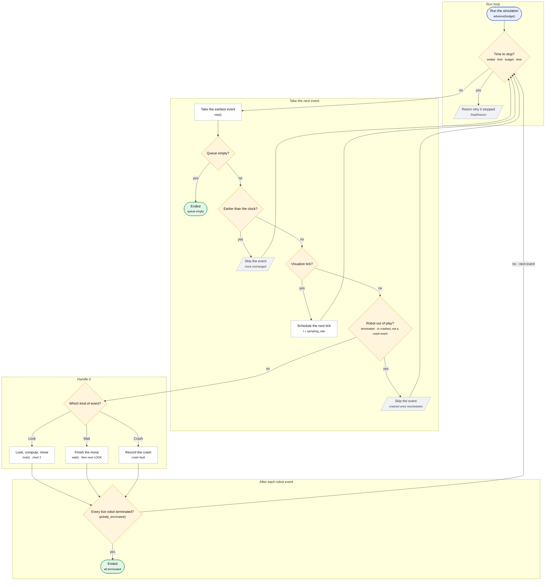
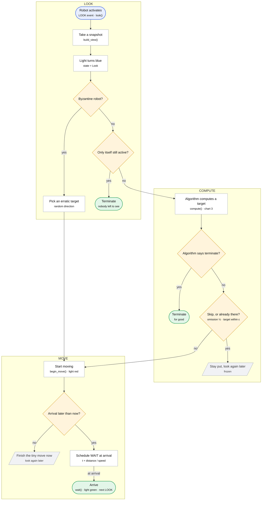
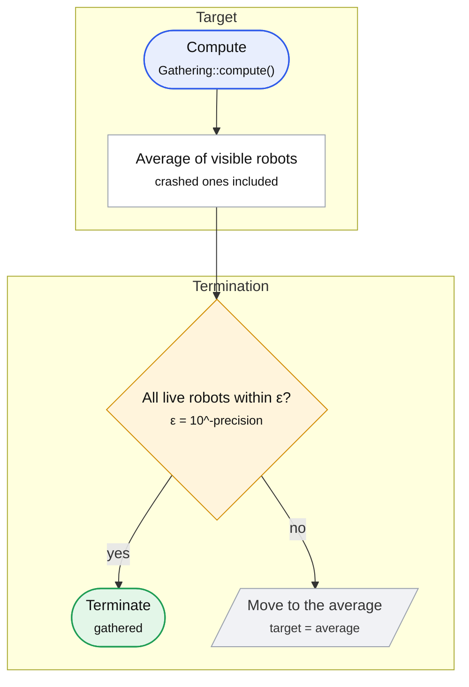
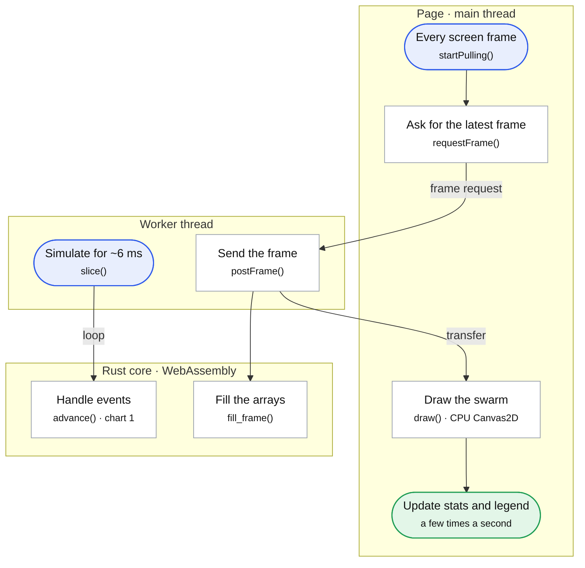

# Flowcharts

How the LCM simulator runs, as flowcharts, each followed by the source of every function
it names. The interactive version is [`web/docs.html`](../web/docs.html): every step
explains itself, steps marked `</>` open their code, and a guided tour walks through each chart.

> Generated by [`scripts/gen-flowcharts.py`](../scripts/gen-flowcharts.py). The code blocks
> are copied from the source files, so edits made here are overwritten. Re-run the script
> after changing any function a chart names.

## Contents

1. [The event loop](#1-the-event-loop) — How the scheduler takes and handles events
2. [One Look–Compute–Move cycle](#2-one-lookcomputemove-cycle) — Everything a robot does when it activates
3. [Gathering (center of gravity)](#3-gathering-center-of-gravity) — The one algorithm ported so far
4. [In the browser](#4-in-the-browser) — Page, worker and Rust core working together

---

## 1. The event loop

The scheduler is a queue of timed events: each robot's next LOOK or WAIT, a crash, and a periodic Visualize tick. advance() handles them one at a time, in time order, until its budget, a limit or the end. This is Scheduler.handle_event in scheduler.py, ported line by line.



- Ties in time break exactly as in Python's heap of (time, id, state) tuples: lower robot id first, then Crash < Look < Visualize < Wait.
- Visualize ticks change nothing; they are kept so event counts and limits match the Python.
- The run ends when every robot that is neither crashed nor Byzantine has terminated.

| Step | What happens |
| --- | --- |
| Run the simulation | The worker calls this with a budget: how many events it may handle and the latest simulated time it may reach. It handles events one after another until a stop condition holds. |
| Time to stop? | Checked before every event, in this order: has the run ended; has max_time passed or max_events been handled (the same checks as run.py); is this call's event budget used up; is the next event later than the time this call may reach (this is how playback speed is paced)? |
| Return why it stopped | Ended, MaxTime, MaxEvents, Budget or UntilTime. The worker uses this to pace playback and to notice the end of the run. |
| Take the earliest event | Events wait in a priority queue ordered by (time, robot id, kind), exactly like Python's heap of tuples, so ties break the same way. |
| Queue empty? | Does not happen in practice, because the Visualize tick always reschedules itself; handled like the Python: an empty queue ends the run. |
| Ended | The run is over; advance() reports Ended. |
| Earlier than the clock? | Time never goes backwards. Python skips such an event without touching the clock, and so does the port. |
| Skip the event | The event is dropped and the clock stays where it was; the loop takes the next event. |
| Visualize tick? | A periodic event every sampling_rate time units. It changes no robot; it is kept so event counts match the Python. |
| Schedule the next tick | The tick puts itself back in the queue one sampling interval later; no robot changes. |
| Robot out of play? | Yes if the robot has terminated, or if it has crashed and this is not its crash event. A crashed robot's own crash event is not skipped: it goes on to be recorded. |
| Skip the event | A crashed robot is rescheduled after a random delay and otherwise ignored; a terminated robot is simply ignored and never scheduled again. Both exactly as in the Python. |
| Which kind of event? | A robot event is a LOOK (activate), a WAIT (a move ends) or a CRASH (a crash fault takes effect). |
| Look, compute, move | The robot's activation: snapshot, compute a target, start moving. Chart 2 shows every branch. |
| Finish the move | The WAIT event fires at the arrival time: the robot is placed on its target, its light turns green and its next activation is scheduled after a random exponential delay. |
| Record the crash | Crash-faulty robots are crashed from the start (set when the run is built), so they never move; their single crash event only records it, as in the Python. |
| Every live robot terminated? | Crashed and Byzantine robots don't count: the run ends once all the others have terminated. |
| Ended | advance() returns Ended and the page shows that every robot terminated. |

`advance` — [`crates/lcm-core/src/sim.rs:233`](../crates/lcm-core/src/sim.rs#L233)

```rust
/// Handles events until the budget, a limit or the end is reached.
pub fn advance(&mut self, budget: Budget) -> StopReason {
    let mut handled = 0;
    loop {
        if self.ended {
            return StopReason::Ended;
        }
        if self.max_time.is_some_and(|limit| self.now > limit) {
            return StopReason::MaxTime;
        }
        if self.max_events.is_some_and(|limit| self.events >= limit) {
            return StopReason::MaxEvents;
        }
        if handled >= budget.max_events {
            return StopReason::Budget;
        }
        if self
            .queue
            .peek()
            .is_some_and(|e| e.time > budget.until_time)
        {
            return StopReason::UntilTime;
        }
        self.step();
        handled += 1;
    }
}
```

`step` — [`crates/lcm-core/src/sim.rs:261`](../crates/lcm-core/src/sim.rs#L261)

```rust
/// Handles the next event.
pub fn step(&mut self) -> StepInfo {
    let ended = StepInfo {
        time: self.now,
        robot: -1,
        kind: None,
        outcome: StepOutcome::Ended,
    };
    if self.ended {
        return ended;
    }
    let Some(event) = self.queue.pop() else {
        self.ended = true;
        return ended;
    };
    self.events += 1;
    let info = |outcome| StepInfo {
        time: event.time,
        robot: event.robot,
        kind: Some(event.kind),
        outcome,
    };
    if event.time < self.now {
        return StepInfo {
            time: self.now,
            ..info(StepOutcome::Ignored)
        };
    }
    let t = event.time;
    self.now = t;

    if event.robot < 0 {
        if event.kind == EventKind::Visualize {
            self.queue.push(Event {
                time: t + self.sampling,
                robot: -1,
                kind: EventKind::Visualize,
            });
            return info(StepOutcome::Visualize);
        }
        return info(StepOutcome::Ignored);
    }
    let i = usize::try_from(event.robot).unwrap_or(usize::MAX);
    if i >= self.robots.len() {
        return info(StepOutcome::Ignored);
    }
    if self.robots.state[i] == RobotState::Crash && event.kind != EventKind::Crash {
        self.schedule_activation(t, i);
        return info(StepOutcome::Ignored);
    }
    if self.robots.terminated[i] {
        return info(StepOutcome::Ignored);
    }

    let outcome = match event.kind {
        EventKind::Look => self.look(i, t),
        EventKind::Wait => {
            self.wait(i, t);
            self.schedule_activation(t, i);
            StepOutcome::Frozen
        }
        EventKind::Crash => {
            self.robots.fault[i] = FaultKind::Crash;
            self.robots.state[i] = RobotState::Crash;
            StepOutcome::Crashed
        }
        EventKind::Visualize => StepOutcome::Ignored,
    };

    if self.globally_terminated() {
        self.ended = true;
        return info(StepOutcome::Ended);
    }
    info(outcome)
}
```

`schedule_activation` — [`crates/lcm-core/src/sim.rs:494`](../crates/lcm-core/src/sim.rs#L494)

```rust
/// `Scheduler.generate_event`: the random delay is drawn even when a
/// terminated robot gets no new activation.
fn schedule_activation(&mut self, previous: f64, i: usize) {
    let delay = self.rng.exponential(1.0 / self.lambda);
    let time = previous + delay.max(1e-9);
    let kind = if self.robots.state[i] == RobotState::Crash {
        EventKind::Crash
    } else if self.robots.terminated[i] {
        return;
    } else {
        EventKind::Look
    };
    self.queue.push(Event {
        time,
        robot: robot_id(i),
        kind,
    });
}
```

`look` — [`crates/lcm-core/src/sim.rs:358`](../crates/lcm-core/src/sim.rs#L358)

```rust
/// `Robot.look` followed by the LOOK branch of `handle_event`.
fn look(&mut self, i: usize, t: f64) -> StepOutcome {
    let me_index = self.build_view(i, t);
    let r = &mut self.robots;
    r.state[i] = RobotState::Look;
    r.set_light(i, Light::Blue, t);
    let position = r.pos[i];

    if r.fault[i] == FaultKind::Byzantine {
        let reach = self
            .view
            .id
            .iter()
            .zip(&self.view.pos)
            .filter(|(id, _)| **id as usize != i)
            .map(|(_, p)| dist(position, *p))
            .fold(None, |best: Option<f64>, d| {
                Some(best.map_or(d, |b| if d > b { d } else { b }))
            })
            .map_or(10.0, |d| d * 0.5);
        let angle = self.rng.uniform(0.0, 2.0 * std::f64::consts::PI);
        r.target[i] = Some(Point::new(
            position.x + reach * libm::cos(angle),
            position.y + reach * libm::sin(angle),
        ));
        r.frozen[i] = false;
        r.terminated[i] = false;
    } else {
        let active = (0..self.view.len())
            .filter(|&k| !self.view.terminated[k] && self.view.state[k] != RobotState::Crash)
            .count();
        if active <= 1 {
            r.frozen[i] = true;
            r.terminated[i] = true;
            self.wait(i, t);
        } else {
            let look = Look {
                me: robot_id_u32(i),
                me_index,
                position,
                view: &self.view,
                model: &self.model,
            };
            let algorithm = &self.algorithms[usize::from(self.robots.algo[i])];
            let decision = algorithm.compute(&look, &mut self.rng, &mut self.scratch);
            let r = &mut self.robots;
            r.target[i] = Some(decision.target);
            match decision.overlay {
                OverlayUpdate::Keep => {}
                OverlayUpdate::Set(c) => r.overlay[i] = Some(c),
                OverlayUpdate::Clear => r.overlay[i] = None,
            }
            if decision.terminate {
                r.terminated[i] = true;
            }
            if r.terminated[i] {
                self.wait(i, t);
            } else {
                let omit = r.fault[i] == FaultKind::Omission && self.rng.random() < 0.5;
                if omit || dist(decision.target, position) < self.model.eps {
                    self.robots.frozen[i] = true;
                    self.wait(i, t);
                } else {
                    self.robots.frozen[i] = false;
                }
            }
        }
    }

    let r = &self.robots;
    if r.state[i] == RobotState::Crash {
        return StepOutcome::Crashed;
    }
    if r.terminated[i] {
        return StepOutcome::Terminated;
    }
    if r.frozen[i] {
        self.schedule_activation(t, i);
        return StepOutcome::Frozen;
    }
    self.begin_move(i, t)
}
```

`wait` — [`crates/lcm-core/src/sim.rs:475`](../crates/lcm-core/src/sim.rs#L475)

```rust
/// `Robot.wait`.
fn wait(&mut self, i: usize, t: f64) {
    let eps = self.model.eps;
    let r = &mut self.robots;
    let moving = r.state[i] == RobotState::Move;
    let snap_to_target = match (moving, r.start_time[i], r.target[i]) {
        (true, Some(start), Some(target)) if self.rigid || t <= start + 1e-12 => Some(target),
        _ => None,
    };
    let end = snap_to_target.unwrap_or_else(|| r.position_at(i, t, eps));
    if moving && r.start_time[i].is_some() {
        r.travelled[i] += dist(r.start_pos[i], end);
    }
    r.pos[i] = end;
    r.start_time[i] = None;
    r.state[i] = RobotState::Wait;
    r.set_light(i, Light::Green, t);
}
```

`globally_terminated` — [`crates/lcm-core/src/sim.rs:513`](../crates/lcm-core/src/sim.rs#L513)

```rust
/// `Scheduler._check_global_termination`: every robot that is neither
/// crashed nor Byzantine has terminated (vacuously true if none are left).
fn globally_terminated(&self) -> bool {
    let r = &self.robots;
    (0..r.len())
        .filter(|&i| r.state[i] != RobotState::Crash && r.fault[i] != FaultKind::Byzantine)
        .all(|i| r.terminated[i])
}
```

---

## 2. One Look–Compute–Move cycle

The robot takes a snapshot (LOOK), its algorithm computes a target (COMPUTE), and it moves there (MOVE); a WAIT event at the arrival time ends the move. Faults, freezing and termination all branch off this path. This is Robot.look, Robot.move and Robot.wait in robot.py.



- The snapshot is taken at the exact LOOK time: moving robots are seen at their interpolated position, never a stale one.
- A robot freezes (stays put this cycle) when its target is within ε = 10^-precision of where it is, or when an omission fault skips the move (probability ½).
- Rigid and non-rigid movement both reach the target: the WAIT event is scheduled at the full-distance arrival time (finding #3 in report.md).

| Step | What happens |
| --- | --- |
| Robot activates | The robot's LOOK event comes up in the queue. Everything on this chart happens at that single instant, except the final WAIT. |
| Take a snapshot | Every robot's position at this exact time (moving robots are interpolated along their path), keeping those within the visibility radius. The robot sees itself too. |
| Light turns blue | Lights change at most once every 0.5 time units, as in the Python, so a light can lag behind the robot's phase. |
| Byzantine robot? | A Byzantine robot ignores its algorithm entirely. |
| Pick an erratic target | It moves in a random direction by half the distance to the farthest robot it sees (10 if it sees none), and never terminates. |
| Only itself still active? | If every other visible robot has crashed or terminated, or none is visible, the robot terminates. With limited visibility an isolated robot stops: the original's behaviour. |
| Terminate | The robot is marked terminated (and frozen) and is never activated again. |
| Algorithm computes a target | The algorithm sees only the snapshot and returns a target, whether to terminate, and optionally a circle to display. Robots are oblivious: nothing is remembered between activations. |
| Algorithm says terminate? | Each algorithm has its own test; for Gathering, every live visible robot is within ε of the average. |
| Terminate | The robot stops permanently and is drawn grey. |
| Skip, or already there? | An omission-faulty robot skips the move half the time. Any robot whose target is closer than ε = 10^-precision stays put. |
| Stay put, look again later | The robot is marked frozen and its next activation is scheduled after a random exponential delay. |
| Start moving | The move starts now at the robot's speed (40 % for a delay fault); its position is interpolated until it arrives. |
| Arrival later than now? | A tiny move can be shorter than the clock can resolve. As in the Python fix for the endless-simulation bug, it is finished immediately instead of scheduling a WAIT at the same instant. |
| Finish the tiny move now | The robot is placed on its target at once and its next activation is scheduled. |
| Schedule WAIT at arrival | A WAIT event goes in the queue for the moment the robot reaches its target; other robots see it moving until then. |
| Arrive | At the arrival time the robot is placed exactly on its target, its light turns green, and its next LOOK is scheduled. |

`look` — [`crates/lcm-core/src/sim.rs:358`](../crates/lcm-core/src/sim.rs#L358)

```rust
/// `Robot.look` followed by the LOOK branch of `handle_event`.
fn look(&mut self, i: usize, t: f64) -> StepOutcome {
    let me_index = self.build_view(i, t);
    let r = &mut self.robots;
    r.state[i] = RobotState::Look;
    r.set_light(i, Light::Blue, t);
    let position = r.pos[i];

    if r.fault[i] == FaultKind::Byzantine {
        let reach = self
            .view
            .id
            .iter()
            .zip(&self.view.pos)
            .filter(|(id, _)| **id as usize != i)
            .map(|(_, p)| dist(position, *p))
            .fold(None, |best: Option<f64>, d| {
                Some(best.map_or(d, |b| if d > b { d } else { b }))
            })
            .map_or(10.0, |d| d * 0.5);
        let angle = self.rng.uniform(0.0, 2.0 * std::f64::consts::PI);
        r.target[i] = Some(Point::new(
            position.x + reach * libm::cos(angle),
            position.y + reach * libm::sin(angle),
        ));
        r.frozen[i] = false;
        r.terminated[i] = false;
    } else {
        let active = (0..self.view.len())
            .filter(|&k| !self.view.terminated[k] && self.view.state[k] != RobotState::Crash)
            .count();
        if active <= 1 {
            r.frozen[i] = true;
            r.terminated[i] = true;
            self.wait(i, t);
        } else {
            let look = Look {
                me: robot_id_u32(i),
                me_index,
                position,
                view: &self.view,
                model: &self.model,
            };
            let algorithm = &self.algorithms[usize::from(self.robots.algo[i])];
            let decision = algorithm.compute(&look, &mut self.rng, &mut self.scratch);
            let r = &mut self.robots;
            r.target[i] = Some(decision.target);
            match decision.overlay {
                OverlayUpdate::Keep => {}
                OverlayUpdate::Set(c) => r.overlay[i] = Some(c),
                OverlayUpdate::Clear => r.overlay[i] = None,
            }
            if decision.terminate {
                r.terminated[i] = true;
            }
            if r.terminated[i] {
                self.wait(i, t);
            } else {
                let omit = r.fault[i] == FaultKind::Omission && self.rng.random() < 0.5;
                if omit || dist(decision.target, position) < self.model.eps {
                    self.robots.frozen[i] = true;
                    self.wait(i, t);
                } else {
                    self.robots.frozen[i] = false;
                }
            }
        }
    }

    let r = &self.robots;
    if r.state[i] == RobotState::Crash {
        return StepOutcome::Crashed;
    }
    if r.terminated[i] {
        return StepOutcome::Terminated;
    }
    if r.frozen[i] {
        self.schedule_activation(t, i);
        return StepOutcome::Frozen;
    }
    self.begin_move(i, t)
}
```

`build_view` — [`crates/lcm-core/src/sim.rs:337`](../crates/lcm-core/src/sim.rs#L337)

```rust
/// The snapshot robot `i` takes at `t`, filtered by its visibility.
fn build_view(&mut self, i: usize, t: f64) -> usize {
    let me = self.robots.pos[i];
    let visibility = self.model.visibility;
    let unlimited = visibility == f64::INFINITY;
    self.view.clear();
    let mut me_index = 0;
    for j in 0..self.robots.len() {
        let p = self.robots.position_at(j, t, self.model.eps);
        if unlimited || dist(me, p) <= visibility {
            if j == i {
                me_index = self.view.len();
            }
            let r = &self.robots;
            self.view
                .push(robot_id_u32(j), p, r.state[j], r.terminated[j], r.frozen[j]);
        }
    }
    me_index
}
```

`compute` — [`crates/lcm-algorithms/src/gathering.rs:14`](../crates/lcm-algorithms/src/gathering.rs#L14)

```rust
#[allow(clippy::cast_precision_loss)]
fn compute(&self, look: &Look<'_>, _: &mut Rng, _: &mut Scratch) -> Decision {
    let view = look.view;
    // The Python average includes crashed robots; its termination test does not.
    let (mut x, mut y) = (0.0, 0.0);
    for p in &view.pos {
        x += p.x;
        y += p.y;
    }
    let n = view.len() as f64;
    let target = Point::new(x / n, y / n);
    let terminate = view
        .pos
        .iter()
        .zip(&view.state)
        .filter(|(_, s)| **s != RobotState::Crash)
        .all(|(p, _)| dist(*p, target) <= look.model.eps);
    Decision {
        target,
        terminate,
        overlay: OverlayUpdate::Keep,
    }
}
```

`schedule_activation` — [`crates/lcm-core/src/sim.rs:494`](../crates/lcm-core/src/sim.rs#L494)

```rust
/// `Scheduler.generate_event`: the random delay is drawn even when a
/// terminated robot gets no new activation.
fn schedule_activation(&mut self, previous: f64, i: usize) {
    let delay = self.rng.exponential(1.0 / self.lambda);
    let time = previous + delay.max(1e-9);
    let kind = if self.robots.state[i] == RobotState::Crash {
        EventKind::Crash
    } else if self.robots.terminated[i] {
        return;
    } else {
        EventKind::Look
    };
    self.queue.push(Event {
        time,
        robot: robot_id(i),
        kind,
    });
}
```

`begin_move` — [`crates/lcm-core/src/sim.rs:441`](../crates/lcm-core/src/sim.rs#L441)

```rust
/// `Robot.move` and the WAIT scheduling that follows it.
fn begin_move(&mut self, i: usize, t: f64) -> StepOutcome {
    let r = &mut self.robots;
    let Some(target) = r.target[i] else {
        r.state[i] = RobotState::Wait;
        self.schedule_activation(t, i);
        return StepOutcome::Frozen;
    };
    r.state[i] = RobotState::Move;
    r.set_light(i, Light::Red, t);
    r.start_time[i] = Some(t);
    r.start_pos[i] = r.pos[i];
    let distance = dist(r.start_pos[i], target);
    let duration = if r.speed[i] > 1e-9 {
        distance / r.speed[i]
    } else {
        0.0
    };
    let arrival = t + duration.max(0.0);
    if arrival <= t {
        // Sub-tick move: finish it now rather than schedule a WAIT at the same instant.
        self.wait(i, t);
        self.schedule_activation(t, i);
        StepOutcome::Frozen
    } else {
        self.queue.push(Event {
            time: arrival,
            robot: robot_id(i),
            kind: EventKind::Wait,
        });
        StepOutcome::Moved
    }
}
```

`wait` — [`crates/lcm-core/src/sim.rs:475`](../crates/lcm-core/src/sim.rs#L475)

```rust
/// `Robot.wait`.
fn wait(&mut self, i: usize, t: f64) {
    let eps = self.model.eps;
    let r = &mut self.robots;
    let moving = r.state[i] == RobotState::Move;
    let snap_to_target = match (moving, r.start_time[i], r.target[i]) {
        (true, Some(start), Some(target)) if self.rigid || t <= start + 1e-12 => Some(target),
        _ => None,
    };
    let end = snap_to_target.unwrap_or_else(|| r.position_at(i, t, eps));
    if moving && r.start_time[i].is_some() {
        r.travelled[i] += dist(r.start_pos[i], end);
    }
    r.pos[i] = end;
    r.start_time[i] = None;
    r.state[i] = RobotState::Wait;
    r.set_light(i, Light::Green, t);
}
```

---

## 3. Gathering (center of gravity)

Each robot moves to the average position of the robots it sees. Repeated asynchronously, the swarm converges to a single point. This is Robot._midpoint and Robot._midpoint_terminal in robot.py.



- The average includes crashed robots, but the termination test ignores them: the original's behaviour, kept on purpose (finding #4 in report.md).
- The sum is a plain left-to-right loop, as in the Python, so results match to the last digits.

| Step | What happens |
| --- | --- |
| Compute | Called from the COMPUTE phase of chart 2 with the robot's snapshot. |
| Average of visible robots | Sum of every visible robot's position, divided by how many there are. |
| All live robots within ε? | Every visible robot that has not crashed must be within ε of the average. |
| Terminate | The robot has gathered with everyone it can see and stops for good. |
| Move to the average | The average becomes the robot's target; chart 2 takes over (freeze check, then the move). |

`compute` — [`crates/lcm-algorithms/src/gathering.rs:14`](../crates/lcm-algorithms/src/gathering.rs#L14)

```rust
#[allow(clippy::cast_precision_loss)]
fn compute(&self, look: &Look<'_>, _: &mut Rng, _: &mut Scratch) -> Decision {
    let view = look.view;
    // The Python average includes crashed robots; its termination test does not.
    let (mut x, mut y) = (0.0, 0.0);
    for p in &view.pos {
        x += p.x;
        y += p.y;
    }
    let n = view.len() as f64;
    let target = Point::new(x / n, y / n);
    let terminate = view
        .pos
        .iter()
        .zip(&view.state)
        .filter(|(_, s)| **s != RobotState::Crash)
        .all(|(p, _)| dist(*p, target) <= look.model.eps);
    Decision {
        target,
        terminate,
        overlay: OverlayUpdate::Keep,
    }
}
```

---

## 4. In the browser

The page never runs the simulation itself. A Web Worker owns the Rust core and simulates in short slices at the chosen playback speed; the page asks for the latest frame whenever it is ready to draw, so drawing never slows the simulation.



- Frames travel as typed arrays that are transferred, not copied or turned into JSON; the page hands each frame's arrays back to be refilled, so playback allocates nothing per frame.
- The worker computes in ~6 ms slices and yields between them, so messages (frame requests, pause, speed changes) get through immediately.

| Step | What happens |
| --- | --- |
| Every screen frame | While playing, the page runs one loop per screen refresh. |
| Ask for the latest frame | At most one request is in flight. The previous frame's arrays go back to the worker to be refilled. |
| Simulate for ~6 ms | Runs continuously while playing, pacing itself to the playback speed, and yields between slices so messages get through. |
| Handle events | The core handles a batch of events; the batch size adapts so one call takes about 1 ms. |
| Send the frame | Answers a frame request with the current state and transfers the arrays to the page. |
| Fill the arrays | Positions, state flags, lights, faults, targets and circles, written straight into the recycled arrays. |
| Draw the swarm | Tiny robots are drawn as rectangles, larger ones as pre-drawn sprites per colour; at most one draw per screen frame. 10,000 robots take about 4–6 ms without a GPU. |
| Update stats and legend | Time, events per second, terminated count and the legend counts, refreshed at most every 200 ms so the page stays light. |

`startPulling` — [`web/client.js:70`](../web/client.js#L70)

```js
startPulling() {
  if (this.pulling) return;
  this.pulling = true;
  const loop = () => {
    if (!this.pulling) return;
    this.requestFrame();
    requestAnimationFrame(loop);
  };
  requestAnimationFrame(loop);
}
```

`requestFrame` — [`web/client.js:61`](../web/client.js#L61)

```js
requestFrame() {
  if (this.pending) return;
  this.pending = true;
  const buffers = this.recycle;
  this.recycle = null;
  if (buffers) this.post({ type: "frame", buffers }, ARRAYS.map((k) => buffers[k].buffer));
  else this.post({ type: "frame" });
}
```

`slice` — [`web/worker.js:63`](../web/worker.js#L63)

```js
function slice(gen) {
  if (!sim || !playing || gen !== generation) return;
  const start = performance.now();
  const due = speed === Infinity ? Infinity : anchor.sim + ((start - anchor.wall) / 1000) * speed;
  let caughtUp = false;
  while (performance.now() - start < SLICE_MS) {
    const t0 = performance.now();
    const code = sim.advance(batch, due);
    const took = performance.now() - t0;
    if (code === 1) { caughtUp = true; break; }          // reached the time the clock allows
    if (code !== 0) { stop = STOP[code]; playing = false; break; }
    if (took < 0.5) batch = Math.min(batch * 2, 1 << 20);
    else if (took > 2) batch = Math.max(batch >> 1, 1);
  }
  busyMs += performance.now() - start;
  // Falling more than a quarter second behind: drop the backlog rather than burst to catch up.
  if (!caughtUp && speed !== Infinity && due - sim.time() > speed * 0.25) reanchor();
  if (!playing) postFrame();       // tell the page it ended without waiting to be asked
  else if (caughtUp) setTimeout(slice, IDLE_MS, gen);
  else yieldThenSlice();
}
```

`advance` — [`crates/lcm-wasm/src/lib.rs:67`](../crates/lcm-wasm/src/lib.rs#L67)

```rust
/// Handles up to `max_events` events, stopping early before the first
/// event after `until_time`, at a configured limit, or at the end.
pub fn advance(&mut self, max_events: u32, until_time: f64) -> Stop {
    self.sim
        .advance(Budget {
            max_events: u64::from(max_events),
            until_time,
        })
        .into()
}
```

`postFrame` — [`web/worker.js:93`](../web/worker.js#L93)

```js
function postFrame(extra = {}) {
  const n = sim.robot_count();
  const b = spare && spare.flags.length === n ? spare : freshBuffers(n);
  spare = null;
  sim.fill_frame(b.xy, b.flags, b.light, b.fault, b.task, b.target, b.circle);
  const now = performance.now();
  self.postMessage({
    type: "frame",
    run,
    time: sim.time(),
    events: sim.event_count(),
    robots: n,
    terminated: sim.terminated_count(),
    ended: sim.ended(),
    stop,
    playing,
    busy: sinceMs ? Math.min(1, busyMs / (now - sinceMs)) : 0,
    ...extra,
    ...b,
  }, Object.values(b).map((a) => a.buffer));
  busyMs = 0;
  sinceMs = now;
}
```

`fill_frame` — [`crates/lcm-wasm/src/lib.rs:190`](../crates/lcm-wasm/src/lib.rs#L190)

```rust
/// Captures the current state straight into caller-owned arrays, so the
/// page can hand the same buffers back every frame instead of allocating
/// new ones. Each array must have the length the getters below return.
#[allow(clippy::too_many_arguments)]
pub fn fill_frame(
    &mut self,
    xy: &mut [f32],
    flags: &mut [u8],
    light: &mut [u8],
    fault: &mut [u8],
    task: &mut [u8],
    target: &mut [f32],
    circle: &mut [f32],
) {
    self.capture_frame();
    let f = &self.frame;
    copy(xy, &f.xy);
    copy(flags, &f.flags);
    copy(light, &f.light);
    copy(fault, &f.fault);
    copy(task, &f.task);
    copy(target, &f.target);
    copy(circle, &f.circle);
}
```

`draw` — [`web/renderer.js:202`](../web/renderer.js#L202)

```js
draw(ctx = this.ctx, dpr = this.dpr) {
  const t0 = performance.now();
  const frame = this.frame;
  ctx.setTransform(dpr, 0, 0, dpr, 0, 0);
  ctx.fillStyle = this.theme.bg;
  ctx.fillRect(0, 0, this.width, this.height);

  const s = this.scale;
  const ox = this.width / 2 + this.pan.x;
  const oy = this.height / 2 + this.pan.y;
  const X = (x) => ox + x * s;
  const Y = (y) => oy - y * s;

  // World bounds.
  ctx.strokeStyle = this.theme.bounds;
  ctx.lineWidth = 1;
  ctx.setLineDash([5, 5]);
  ctx.strokeRect(X(-this.world.w / 2), Y(this.world.h / 2), this.world.w * s, this.world.h * s);
  ctx.setLineDash([]);
  if (!frame) { this.lastDrawMs = performance.now() - t0; return; }

  const { xy, flags, fault, task, light, target, circle } = frame;
  const n = flags.length;
  if (this.colorOf.length !== n) this.colorOf = new Uint8Array(n);
  const colorOf = this.colorOf, counts = this.counts;
  counts.fill(0);
  for (let i = 0; i < n; i++) { const c = colorIndex(flags[i], fault[i], task[i]); colorOf[i] = c; counts[c]++; }
  const r = this.robotRadius(n);
  const V = this.options.visibility;

  // Visibility circles (behind everything).
  if (V && n <= LOD.visibility) {
    ctx.strokeStyle = "rgba(100,110,200,.22)";
    ctx.beginPath();
    for (let i = 0; i < n; i++) {
      if ((flags[i] & 3) === STATE_CRASH || flags[i] & TERMINATED) continue;
      const x = X(xy[2 * i]), y = Y(xy[2 * i + 1]);
      ctx.moveTo(x + V * s, y);
      ctx.arc(x, y, V * s, 0, 2 * Math.PI);
    }
    ctx.stroke();
  }

  // Circles the robots computed (SEC and friends).
  if (n <= LOD.circles) {
    ctx.strokeStyle = "rgba(255,150,0,0.55)";
    ctx.lineWidth = 1.5;
    ctx.beginPath();
    for (let i = 0; i < n; i++) {
      const cr = circle[3 * i + 2];
      if (!(cr >= 0)) continue;
      const cx = X(circle[3 * i]), cy = Y(circle[3 * i + 1]);
      ctx.moveTo(cx + cr * s, cy);
      ctx.arc(cx, cy, cr * s, 0, 2 * Math.PI);
    }
    ctx.stroke();
    ctx.lineWidth = 1;
  }

  // Dashed line from each moving robot to its target, in the robot's colour.
  if (n <= LOD.targets) {
    ctx.setLineDash([2, 3]);
    for (let c = 0; c < COLORS.length; c++) {
      if (!counts[c]) continue;
      ctx.beginPath();
      let any = false;
      for (let i = 0; i < n; i++) {
        if (colorOf[i] !== c || (flags[i] & 3) !== STATE_MOVE || !(target[2 * i] === target[2 * i])) continue;
        ctx.moveTo(X(xy[2 * i]), Y(xy[2 * i + 1]));
        ctx.lineTo(X(target[2 * i]), Y(target[2 * i + 1]));
        any = true;
      }
      if (any) { ctx.strokeStyle = COLORS[c].fill; ctx.globalAlpha = 0.7; ctx.stroke(); ctx.globalAlpha = 1; }
    }
    ctx.setLineDash([]);
  }

  // Robot bodies, colour by colour: fillRect dots, or stamped sprites.
  const snap = (v) => Math.round(v * dpr) / dpr;
  const outline = n <= LOD.outlines ? this.theme.outline : null;
  for (let c = 0; c < COLORS.length; c++) {
    if (!counts[c]) continue;
    if (r < 2) {
      ctx.fillStyle = COLORS[c].fill;
      const d = 2 * r;
      for (let i = 0; i < n; i++) {
        if (colorOf[i] === c) ctx.fillRect(snap(X(xy[2 * i]) - r), snap(Y(xy[2 * i + 1]) - r), d, d);
      }
    } else {
      const sp = this.sprite(COLORS[c].fill, r, dpr, { outline });
      for (let i = 0; i < n; i++) {
        if (colorOf[i] === c) ctx.drawImage(sp.canvas, snap(X(xy[2 * i]) - sp.half), snap(Y(xy[2 * i + 1]) - sp.half), sp.size, sp.size);
      }
    }
  }

  // Luminous-robot lights: a ring in the light's colour.
  if (this.options.showLights) {
    for (let l = 1; l < LIGHTS.length; l++) {
      const sp = this.sprite(LIGHTS[l], r + 2.5, dpr, { ring: r >= 2 ? 2 : 1 });
      for (let i = 0; i < n; i++) {
        if (light[i] === l) ctx.drawImage(sp.canvas, snap(X(xy[2 * i]) - sp.half), snap(Y(xy[2 * i + 1]) - sp.half), sp.size, sp.size);
      }
    }
  }

  // Hovered and selected robots, drawn in full at any swarm size.
  const mark = (i, ring, strong) => {
    if (i < 0 || i >= n) return;
    const x = X(xy[2 * i]), y = Y(xy[2 * i + 1]);
    ctx.strokeStyle = this.theme.accent;
    if (strong) {
      if (V && !((flags[i] & 3) === STATE_CRASH)) {
        ctx.globalAlpha = 0.35;
        ctx.beginPath(); ctx.arc(x, y, V * s, 0, 2 * Math.PI); ctx.stroke();
        ctx.globalAlpha = 1;
      }
      const cr = circle[3 * i + 2];
      if (cr >= 0) {
        ctx.strokeStyle = "rgba(255,150,0,0.9)"; ctx.lineWidth = 1.5;
        ctx.beginPath(); ctx.arc(X(circle[3 * i]), Y(circle[3 * i + 1]), cr * s, 0, 2 * Math.PI); ctx.stroke();
        ctx.strokeStyle = this.theme.accent;
      }
      if (target[2 * i] === target[2 * i]) {
        const tx = X(target[2 * i]), ty = Y(target[2 * i + 1]);
        ctx.setLineDash([4, 4]); ctx.lineWidth = 1.5;
        ctx.beginPath(); ctx.moveTo(x, y); ctx.lineTo(tx, ty); ctx.stroke();
        ctx.setLineDash([]);
        ctx.beginPath(); ctx.moveTo(tx - 5, ty - 5); ctx.lineTo(tx + 5, ty + 5); ctx.moveTo(tx + 5, ty - 5); ctx.lineTo(tx - 5, ty + 5); ctx.stroke();
      }
    }
    ctx.lineWidth = strong ? 2.5 : 1.5;
    ctx.beginPath(); ctx.arc(x, y, Math.max(r, 2) + ring, 0, 2 * Math.PI); ctx.stroke();
    ctx.lineWidth = 1;
  };
  if (this.hovered !== this.selected) mark(this.hovered, 4, false);
  mark(this.selected, 5, true);

  this.lastDrawMs = performance.now() - t0;
  this.onDraw?.(this);
}
```
